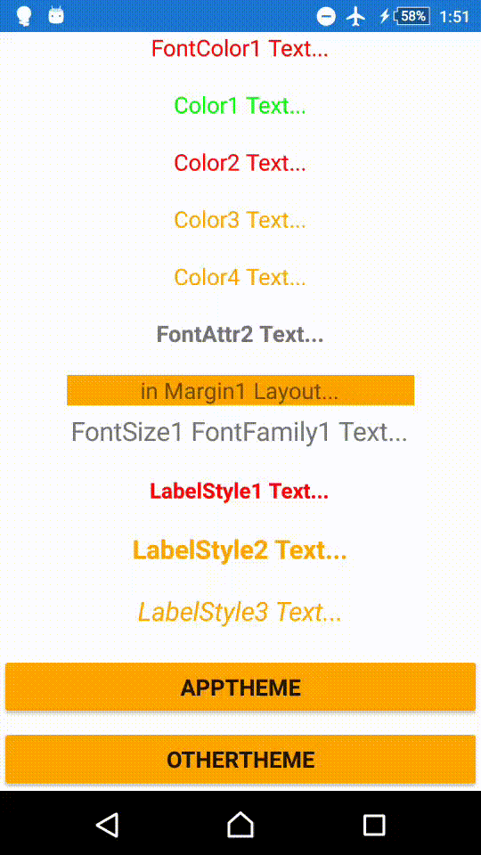

## Xamarin.Forms Theme ResourceDictionary Sample

ResourceDictionary XAML を作成し、アプリのスタイル設定を集約するサンプルプロジェクトです。

`Resources/AppTheme.xaml` と `Resources/OtherTheme.xaml` の二つの Theme を作成し、アプリ実行中にリアルタイムに切り替えるサンプルとなっています。

解説は [Xamarin.Forms の Theme ResouceDictionary を使いこなそう！](http://qiita.com/irgaly/items/32e62b3d39d669a5dfdd) を参照してください。

